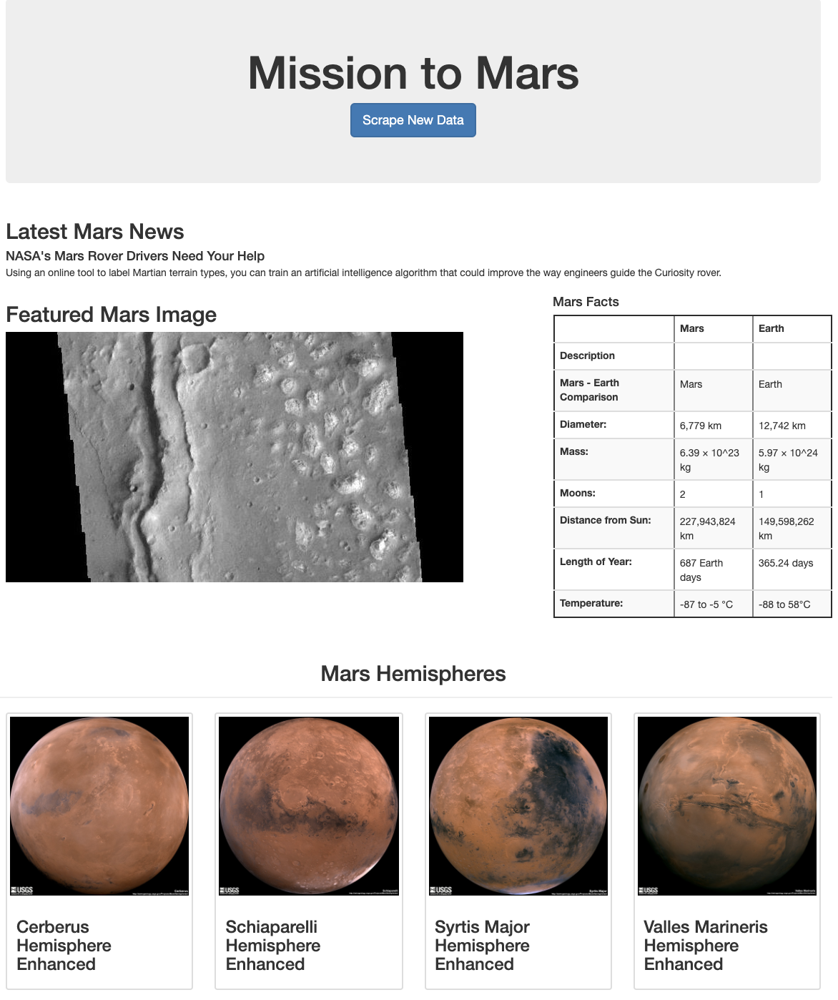

# Web Scraping - Mission to Mars
Python, BeuatifulSoup, Pandas, Splinter to scrape NASA Mars News and save data in Mongodb


Built a web application that scrapes various websites for data related to the Mission to Mars and displays the information in a single HTML page. 

### Setup
1. Created a new repository for this project called `web-scraping`.

2. Cloned the new repository to the computer.

3. Inside the local git repository, created a directory for the web scraping activity. Used a folder name to correspond to the challenge: **Missions_to_Mars**.

4. Added the Jupyter notebook files to this folder as well as the flask app.

5. Pushed the above changes to GitHub or GitLab.

## Step 1 - Scraping

Completed the initial scraping using Jupyter Notebook, BeautifulSoup, Pandas, and Splinter.

* Created a Jupyter Notebook file called `mission_to_mars.ipynb` and used this to complete all of the scraping and analysis tasks. The following outlines what was scraped.

### NASA Mars News

* Scraped the [Mars News Site](https://redplanetscience.com/) and collected the latest News Title and Paragraph Text. Assigned the text to variables that were referenced later.

```python
# Example:
news_title = "NASA's Next Mars Mission to Investigate Interior of Red Planet"

news_p = "Preparation of NASA's next spacecraft to Mars, InSight, has ramped up this summer, on course for launch next May from Vandenberg Air Force Base in central California -- the first interplanetary launch in history from America's West Coast."
```

### JPL Mars Space Images - Featured Image

* Visited the url for the Featured Space Image site [here](https://spaceimages-mars.com).

* Used splinter to navigate the site and find the image url for the current Featured Mars Image and assigned the url string to a variable called `featured_image_url`.

* Made sure to find the image url to the full size `.jpg` image.

* Made sure to save a complete url string for this image.

```python
# Example:
featured_image_url = 'https://spaceimages-mars.com/image/featured/mars2.jpg'
```

### Mars Facts

* Visited the Mars Facts webpage [here](https://galaxyfacts-mars.com) and use Pandas to scrape the table containing facts about the planet including Diameter, Mass, etc.

* Used Pandas to convert the data to a HTML table string.
* Saved a 'mars_table.html' file to view results that were retrieved, then saved in notebook to view any udpates

### Mars Hemispheres

* Visited the astrogeology site [here](https://marshemispheres.com/) to obtain high resolution images for each of Mar's hemispheres.

* Needed to click each of the links to the hemispheres in order to find the image url to the full resolution image.

* Saved both the image url string for the full resolution hemisphere image, and the Hemisphere title containing the hemisphere name. Used a Python dictionary to store the data using the keys `img_url` and `title`.

* Appended the dictionary with the image url string and the hemisphere title to a list. This list will contained one dictionary for each hemisphere.

```python
# Example:
hemisphere_image_urls = [
    {"title": "Valles Marineris Hemisphere", "img_url": "..."},
    {"title": "Cerberus Hemisphere", "img_url": "..."},
    {"title": "Schiaparelli Hemisphere", "img_url": "..."},
    {"title": "Syrtis Major Hemisphere", "img_url": "..."},
]
```

- - -

## Step 2 - MongoDB and Flask Application

Used MongoDB with Flask templating to create a new HTML page that displays all of the information that was scraped from the URLs above.

* Started by converting the Jupyter notebook into a Python script called `scrape_mars.py` with a function called `scrape` that executes all of the scraping code from above and returns one Python dictionary containing all of the scraped data.

* Next, created a route called `/scrape` that imports the  `scrape_mars.py` script and called the  `scrape` function.

  * Stored the return value in Mongo as a Python dictionary.

* Created a root route `/` that queries the Mongo database and passed the mars data into an HTML template to display the data.

* Created a template HTML file called `index.html` that takes the mars data dictionary and display all of the data in the appropriate HTML elements. Used the following as a guide for what the final product should look like, but feel free to create your own design.



- - -

## Other

* Use Splinter to navigate the sites when needed and BeautifulSoup to help find and parse out the necessary data.

* Use Pymongo for CRUD applications for your database. One can simply overwrite the existing document each time the `/scrape` url is visited and new data is obtained.

* Use Bootstrap to structure your HTML template. 
* Responsive (chrome) - some aspects

- - -

© 2021 Trilogy Education Services, LLC, a 2U, Inc. brand. Confidential and Proprietary. All Rights Reserved.
